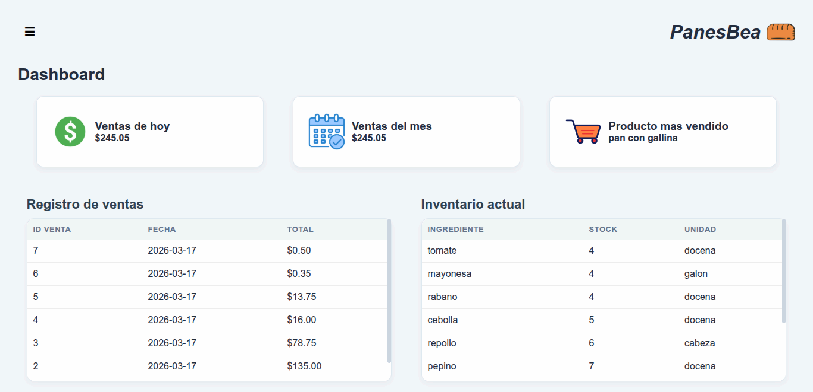
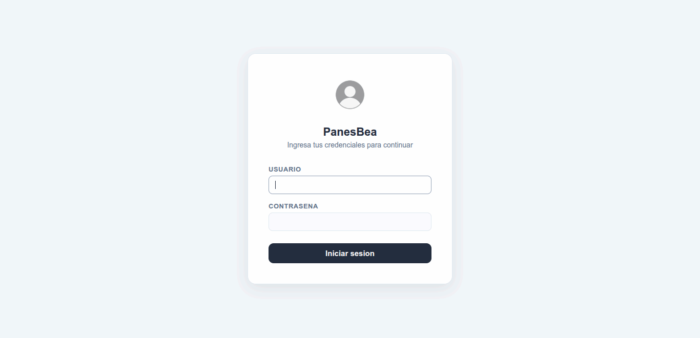

# PanesBea

Sistema de gestión para una panadería. Permite registrar ventas, administrar productos, controlar el inventario de ingredientes y llevar un historial de movimientos. Desarrollado como proyecto escolar.

---

## Capturas de pantalla

### Login


### Dashboard


### Registrar Venta


---

## Funcionalidades

- **Autenticacion** — Login con sesion PHP y proteccion de rutas
- **Dashboard** — Estadisticas del dia, del mes, producto mas vendido, registro de ventas e inventario en tiempo real
- **Facturacion** — Registro de ventas con multiples productos, calculo automatico de subtotales y total
- **Historial de facturacion** — Lista de ventas con opcion de ver detalle y eliminar
- **Productos** — CRUD completo de productos con validacion de uso en ventas
- **Inventario** — Gestion de ingredientes y registro de compras con actualizacion automatica de stock
- **Movimientos** — Registro de entradas y salidas de ingredientes
- **Cierre de sesion** — Destruccion segura de la sesion

---

## Tecnologias utilizadas

- **PHP** — Logica del servidor y manejo de sesiones
- **MySQL** — Base de datos relacional
- **HTML / CSS / JavaScript** — Interfaz de usuario
- **mysqli** — Conexion y consultas a la base de datos

---

## Estructura del proyecto

```
htdocs/
├── .htaccess
├── credentials.php
├── auth.php
├── logout.php
├── mySQLi.php
├── style.css
├── index.php
├── stats.php
├── fax.php
├── editfax.php
├── productos.php
├── box.php
└── mov.php
```

---

## Instalacion local

### Requisitos
- PHP 7.4 o superior
- MySQL 5.7 o superior
- Servidor local (XAMPP, Laragon, etc.)

### Pasos

1. Clona el repositorio:
```bash
git clone https://github.com/tu-usuario/panesbea.git
```

2. Copia los archivos dentro de la carpeta `htdocs` de tu servidor local.

3. Importa la base de datos en phpMyAdmin ejecutando el script SQL incluido en `database.sql`.

4. Abre `mySQLi.php` y actualiza los datos de conexion:
```php
private $host     = "127.0.0.1";
private $user     = "root";
private $password = "tu_password";
private $DB       = "panesBea";
private $port     = "3306";
```

5. Abre `credentials.php` y define tus credenciales de acceso:
```php
define('AUTH_USER', 'admin');
define('AUTH_PASS', password_hash('tu_password', PASSWORD_BCRYPT));
```

6. Accede desde el navegador a `http://localhost/panesbea`.

---

## Despliegue en produccion

El proyecto esta alojado en **InfinityFree**. Para desplegarlo:

1. Crea una cuenta en [infinityfree.com](https://infinityfree.com)
2. Crea el hosting y una base de datos MySQL
3. Importa el script SQL en phpMyAdmin (sin las lineas `DROP` y `CREATE DATABASE`)
4. Actualiza `mySQLi.php` con los datos de conexion de InfinityFree
5. Cambia la ruta en `index.php` de `'../credentials.php'` a `'credentials.php'`
6. Sube los archivos via FTP con FileZilla a la carpeta `htdocs`

---

## Base de datos

```sql
create table venta(
    id_venta int primary key auto_increment not null,
    fecha date,
    total decimal(5,2)
);
create table producto(
    id_producto int primary key auto_increment not null,
    nombre varchar(100),
    precio decimal(5,2)
);
create table detalle_venta(
    id_detalle int primary key auto_increment not null,
    id_venta int not null,
    id_producto int null,
    cantidad int,
    subtotal decimal(5,2),
    FOREIGN KEY (id_venta) REFERENCES venta (id_venta),
    FOREIGN KEY (id_producto) REFERENCES producto (id_producto)
);
create table ingrediente(
    id_ingrediente int primary key auto_increment not null,
    nombre varchar(255),
    stock int,
    unidad_medida varchar(255)
);
create table compra_ingrediente(
    id_compra int primary key auto_increment not null,
    id_ingrediente int null,
    fecha date,
    cantidad int,
    costo decimal(5,2),
    FOREIGN KEY (id_ingrediente) REFERENCES ingrediente (id_ingrediente)
);
create table movimiento(
    id_movimientio int primary key auto_increment not null,
    id_ingrediente int null,
    tipo varchar(10),
    cantidad int,
    FOREIGN KEY (id_ingrediente) REFERENCES ingrediente (id_ingrediente)
);
```

---

## Autor

**Jose Miguel Herrera**
Colegio Centro America

---

> Proyecto desarrollado con fines educativos.
